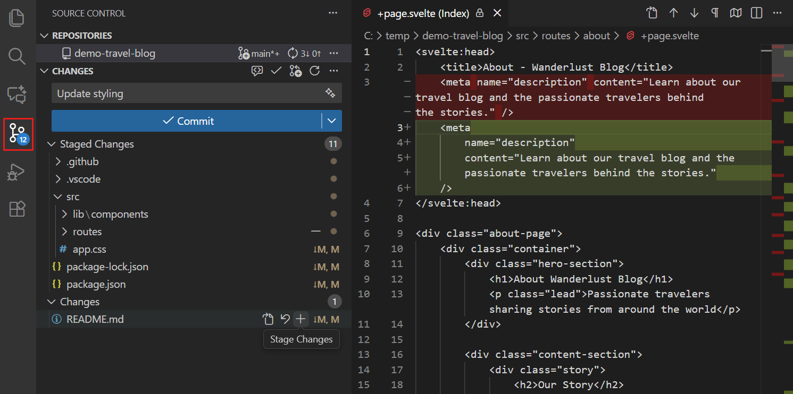
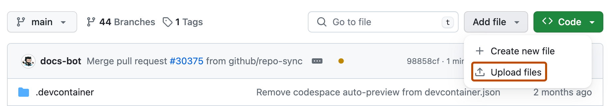

# Notes-SRM-VEC-Sem-3

Class notes for Sem 3, ECE (R2023) — SRM Valliammai.
For classmates, by classmates.

## Subjects

| Code | Subject | Folder |
|---|---|---|
| MA3321 | Transforms and Partial Differential Equations | `MA3321-Transforms-PDE/` |
| EC3362 | Solid State Devices and Circuits | `EC3362-Solid-State-Devices/` |
| EC3363 | Signals and Systems | `EC3363-Signals-Systems/` |
| EE3363 | Electric Circuit Analysis | `EE3363-Circuit-Analysis/` |
| EC3365 | Electromagnetic Fields | `EC3365-EM-Fields/` |
| EC3366 | Digital Systems Design | `EC3366-Digital-System-Design/` |
| EC3367 | Electronics Circuits Design Lab | `EC3367-ECD-Lab/` |
| EE3369 | Circuit Theory and Devices Lab | `EE3369-Circuit-Theory-Lab/` |

Each folder has `notes/`, `question-banks/`, and `lab-manuals/` (labs only).

## Setup (once)

1. **Git** — install from [git-scm.com/downloads](https://git-scm.com/downloads).
2. **VS Code** — install from [code.visualstudio.com](https://code.visualstudio.com/).
3. **Sign in to GitHub in VS Code** — click the Accounts icon (bottom-left), choose *Sign in with GitHub*, and finish in the browser that opens.

## Upload your notes (VS Code)

**1. Open the repo in VS Code.** Press `Ctrl+Shift+P` (Mac: `Cmd+Shift+P`) to open the Command Palette, type `Git: Clone`, and paste the repo link.

You can also click **Clone Repository** on the Welcome / Source Control screen and pick it from the list.

**2. Add your file.** Drag your notes file into the subject folder, e.g. `EC3363-Signals-Systems/notes/`. Name it `Unit-<n>-<topic>-<your-name>.md` (PDFs are fine too).

**3. Commit.** Open **Source Control** (`Ctrl+Shift+G`), type a message like `Add Unit 2 notes - EC3363`, and click **Commit**.

**4. Push.** Click **Sync Changes**.

Done. `add` = pick your file, `commit` = save it with a message, `push` = send it to GitHub.

## On a phone

VS Code doesn't run on phones, so upload in the browser. The GitHub app can't add files — use **Chrome/Safari → github.com** instead.

1. Open the repo, go into the subject folder, then `notes/`.
2. Tap **Add file → Upload files** (or **Create new file** to type a note).
3. Pick your file, write a message, tap **Commit changes**.

If you don't see **Add file**, open the browser menu and turn on **Desktop site**.

## Private repo

This repo is private to classmates. Ask the owner to invite you (Settings → Collaborators), accept the email invite, then upload.

---

Screenshots from the official [VS Code Docs](https://code.visualstudio.com/docs) and [GitHub Docs](https://docs.github.com) (CC BY 4.0).
