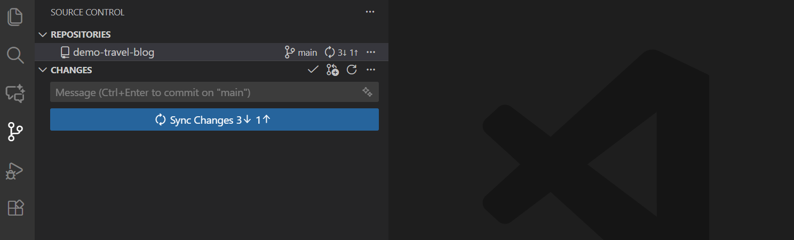

# Notes-SRM-VEC-Sem-3

Class notes for Sem 3, ECE (R2023) — SRM Valliammai.
For classmates, by classmates.

This repo is **public** — anyone can read it. To add notes, open a **pull request**; only the maintainer merges.

## Subjects

| Code | Subject | Folder |
|---|---|---|
| MA3321 | Transforms and Partial Differential Equations | `MA3321-Transforms-PDE/` |
| EC3362 | Solid State Devices and Circuits | `EC3362-Solid-State-Devices/` |
| EC3363 | Signals and Systems | `EC3363-Signals-Systems/` |
| EE3363 | Electric Circuit Analysis | `EE3363-Circuit-Analysis/` |
| EC3365 | Electromagnetic Fields | `EC3365-EM-Fields/` |
| EC3366 | Digital Systems Design | `EC3366-Digital-System-Design/` |
| EC3367 | Electronics Circuits Design Lab | `EC3367-ECD-Lab/` |
| EE3369 | Circuit Theory and Devices Lab | `EE3369-Circuit-Theory-Lab/` |

Each folder has `notes/`, `question-banks/`, and `lab-manuals/` (labs only).

## What you can upload

- **Markdown notes** (`.md`) — typed notes; preview nicely on GitHub.
- **PDF notes** (`.pdf`) — scanned, handwritten, or exported from Word/slides.

Both are accepted. PDFs use exactly the same add → commit → push steps, in VS Code or on a phone. Keep files under ~25 MB for phone uploads (VS Code handles larger).

## Setup (once)

1. **GitHub account** — create a free one at [github.com/signup](https://github.com/signup) and tell the maintainer your username so you can be added as a collaborator.
2. **Git** — install from [git-scm.com/downloads](https://git-scm.com/downloads).
3. **VS Code** — install from [code.visualstudio.com](https://code.visualstudio.com/).
4. **Sign in to GitHub in VS Code** — click the Accounts icon (bottom-left), choose *Sign in with GitHub*, and finish in the browser that opens.


## Upload your notes (VS Code)

**1. Open the repo in VS Code.** Press `Ctrl+Shift+P` (Mac: `Cmd+Shift+P`) to open the Command Palette, type `Git: Clone`, and paste the repo link.


You can also click **Clone Repository** on the Welcome / Source Control screen and pick it from the list.


After the first time, just open that folder in VS Code — no need to clone again.

**2. Update first.** Always get the newest copy before you add anything. Open **Source Control** and click **Sync Changes**. This keeps you current and avoids merge conflicts.



**3. Make your own branch.** Click the branch name in the bottom-left status bar → **Create new branch** → name it after you (e.g. `rahul`). Never work directly on `main` — it's protected, so your push will be rejected.

**4. Add your file.** Drag your notes file into the subject folder, e.g. `EC3363-Signals-Systems/notes/`. Name it `Unit-<n>-<topic>-<your-name>.md` or `...-<your-name>.pdf` — both are accepted.

**5. Commit.** In **Source Control** (`Ctrl+Shift+G`), type a message like `Add Unit 2 notes - EC3363`, and click **Commit**.


**6. Push your branch.** Click **Publish Branch** (or **Sync Changes**).

**7. Open a pull request.** On GitHub, click **Compare & pull request** → **Create pull request**.


**8. The maintainer merges.** Nothing goes into `main` until the maintainer approves and merges your pull request. That's the rule — reads are open, merges are theirs.

`add` = pick your file, `commit` = save it with a message, `push` = send it for review.

**Avoiding conflicts:** update before you start, always work on your own branch, commit in small steps, and push as soon as you commit. If two people edit the same file, VS Code shows the clash and lets you pick **Accept Incoming** or **Accept Current** — never keep both copies of the same file. Tip: add your own file instead of editing someone else's.

## Commands (the same steps in a terminal)

Do these **in this order**. Install Git first (see Setup). Run them from inside the repo folder.

```bash
# once, to get the repo
git clone <repo-link>
cd Notes-SRM-VEC-Sem-3

# every time you upload, in this order
git pull                                       # 1. update first (newest notes)
git checkout -b your-name                      # 2. your own branch (never main)
git add EC3363-Signals-Systems/notes/Unit-2-Fourier-rahul.pdf   # 3. stage your file
git commit -m "Add Unit 2 notes - EC3363"     # 4. save it with a message
git push -u origin your-name                   # 5. send your branch
# 6. open a pull request on GitHub; the maintainer merges
```

- **Order matters:** pull → branch → add → commit → push. Pulling first is what keeps you current and avoids conflicts; committing before you pull creates them.
- `git add .` stages everything you changed — use it only when all the changes are yours.
- Made a mistake in the last commit? `git reset --soft HEAD~1` undoes the commit but keeps your file; then fix and commit again.

## On a phone

VS Code doesn't run on phones, so upload in the browser. The GitHub app can't add files — use **Chrome/Safari → github.com** instead.

1. Open the repo, go into the subject folder, then `notes/`.
2. Refresh the page first so you see the newest files (mobile GitHub sometimes shows an old copy).
3. Tap **Add file → Upload files** for a PDF or photo, or **Create new file** to type a `.md` note.
4. Pick your file, write a message, and choose **Create a new branch for this commit and start a pull request**.
5. Tap **Commit changes**, then **Create pull request**. The maintainer merges.


If you don't see **Add file**, open the browser menu and turn on **Desktop site**.

## Who can merge

Only the maintainer (@MDHaarith). `main` is protected: direct pushes are blocked, every change must come through a pull request, and the maintainer's review is required before it can merge.

---

Screenshots from the official [VS Code Docs](https://code.visualstudio.com/docs) and [GitHub Docs](https://docs.github.com) (CC BY 4.0).
